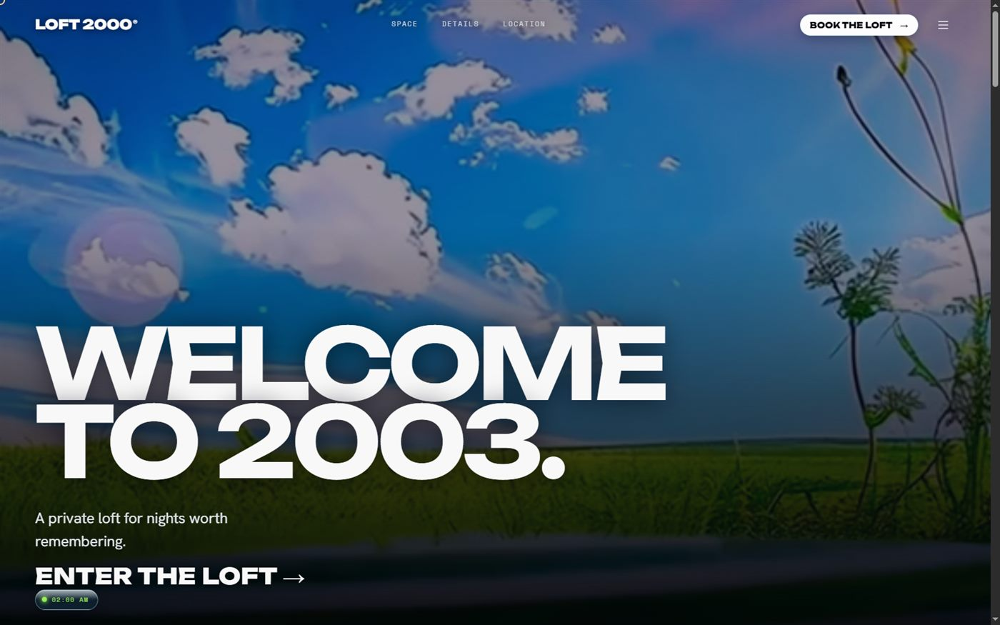
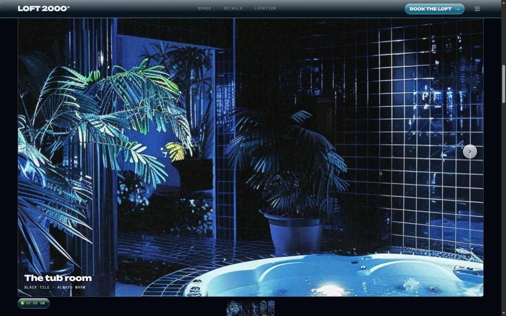

# LOFT 2000®

**Live:** https://krim1345.github.io/loft-2000/

A rentable apartment that got stuck somewhere around 2003 — chrome remotes,
a CRT in the corner, a jacuzzi lit up like a nightclub. This repo is the
landing page for it: a fictional Brooklyn loft, built as a mood more than a
product page. The clock across the top actually runs the room — flip it to
`DAY / SUNSET / 02:00 AM` and every colour on the page follows.

Небольшое предисловие: это не настоящая квартира и не настоящий листинг —
это лендинг для *вымышленного* лофта в Бруклине, который как будто застрял
в 2003 году: хромированный пульт, CRT-телевизор, светящееся джакузи в стиле
Frutiger Aero. Идея была не "сделать сайт для аренды", а сделать *ощущение
места* — переключатель `DAY / SUNSET / 02:00 AM` наверху страницы реально
управляет светом всей страницы целиком, а не просто мигает картинкой.

|                                                        |                                                              |
| ------------------------------------------------------ | ------------------------------------------------------------ |
|                            |                            |
| Hero — cinematic full-bleed loop, mood dock bottom-left | Space — draggable photo gallery, real liminal interiors      |

---

## Run it

**No build, right now** — open `preview/index.html` in a browser. It is the
same page, hand-written in vanilla JS, sharing the exact stylesheets the React
build uses. No Node, no network, no install (fonts and the map embed do need
network).

**The React app** — needs Node, which is not installed on this machine yet:

```bash
npm install && npm run dev
```

React 18 · Vite · Tailwind v4 · `motion/react` · lucide-react.

**Deployed**: https://krim1345.github.io/loft-2000/ — served from `docs/`,
a flattened copy of `preview/index.html`. To update the live site after
changing `preview/`, `src/styles/`, `public/fonts/`, or `public/gallery/`,
rebuild `docs/` (rewrite `../src/styles/` → `styles/`, `../public/hero.mp4` →
`hero.mp4`, `../public/loft.mp4` → `loft.mp4`, `../public/gallery/` →
`gallery/`; copy `fonts.css`/`tokens.css`/`loft.css`, `hero.mp4`, `loft.mp4`,
`gallery/*.jpg`, `fonts/*.woff2`) and push.

## How it is put together

```
src/styles/fonts.css     self-hosted @font-face — Unbounded, Hanken Grotesk, Space Mono
src/styles/tokens.css    every colour, type role, space and easing
src/styles/loft.css      the whole page's styles (self-sufficient)
src/lib/mood.jsx         the one state that re-lights the entire page
src/components/Plan.jsx  the drawn floor plan
src/components/Cursor.jsx  the squash-and-stretch custom cursor
preview/index.html       no-build twin, links the same three stylesheets
public/hero.mp4          hero background loop (real footage, supplied)
public/loft.mp4          the Y2K aqua reel — plays "what's on the screens"
public/gallery/*.jpg     three real liminal-interior photographs (the gallery)
fonts/*.woff2            root-absolute copy of public/fonts/ — see below
```

`tokens.css` and `loft.css` are the single source of truth — both the React
app and `preview/index.html` link them, so a change to either shows up in
both.

**Why fonts exist in two places.** `@font-face` in `fonts.css` uses
root-absolute paths (`/fonts/Unbounded-800.woff2`), which is exactly what
Vite's `public/` folder convention resolves to — but the ad-hoc local server
and GitHub Pages both serve from a plain project root, where `/fonts/…`
means a top-level `fonts/` folder, not `public/fonts/`. Both copies must
stay in sync if you add or remove a weight.

## The assets, and what they actually are

Two video sources, used for different reasons:

- **`hero.mp4`** — real, licensed-feeling footage: a slow, near-static aqua
  shot (sky, grass, a waterline, bubbles). It is the hero background, looped
  and muted. Portrait source (576×1024), so `object-position` is tuned to
  keep the waterline centred on a wide screen rather than cropping into flat
  sky.
- **`loft.mp4`** — a 21-second Y2K "aqua" reel: a chrome media-player skin
  with a hand pressing play, an XP-style hillside, bubbles over a skyline,
  water, a rainbow. It is **not** footage of the apartment, so it is never
  presented as one — it plays the part it actually plays, "what's on the
  screens" for the electronics in the Details section, captioned by its
  timecode (`Tape · 00:13`).

The apartment itself is real in two ways:

- **A measured floor plan** (`Plan.jsx`) — 14.2 × 7.3 m, kitchen, bath,
  columns, glazing, balcony, where the CRT and the sofa sit.
- **Three real photographs** (`public/gallery/`) — liminal, blue-lit
  interiors (a jacuzzi, a glass-block wall, a leather lounge) supplied by the
  user, presented as a draggable gallery with a collapsing thumbnail strip.

### Dropping in more real photos

Add entries to `GALLERY` and `OBJECTS` in `src/lib/content.js` (each item
takes either `src: '/gallery/whatever.jpg'` for a real photo or `t: 12.6` for
a frame of `loft.mp4`). Nothing else has to change — `Space.jsx` and
`Objects.jsx` both render off those arrays.

## Deliberate choices

- **The mood panel is a small persistent dock, not a mid-page section.** A
  chip bottom-left, present from the first frame; click it to expand the
  full `DAY / SUNSET / 02:00 AM` panel. Every colour on the page is a mood
  token, so the whole page re-lights at once. Kept small on purpose — a
  full-size panel fixed over the page for the whole visit would eventually
  collide with something in every section.
- **The lime LCD never changes with the mood.** The electronics do not care
  what time it is — that constant is what makes the light shift legible.
- **Nothing on the page loops or blinks.** Zero infinite animations. The
  grain is one static layer; the level meter only moves when you move the
  room.
- **The cursor has a little water-drop physics.** Position tracks the
  pointer with zero lag; shape doesn't — flick it and the ring stretches
  along the line of travel, then relaxes back to a circle over a few frames.
  Switched off while it's showing a word (`VIEW`/`BOOK`/`EXPLORE`), on
  coarse pointers, and under `prefers-reduced-motion`.
- **The booking flow is a small anchored card, not a fullscreen takeover.**
  Opens from the top-right corner on desktop (where it was summoned from);
  becomes a bottom sheet under 640px, since "small card in the corner"
  stops making spatial sense on a phone.
- **The location map is a real, interactive Google Maps embed** (no API key
  — the `output=embed` share URL), centred on a plausible Williamsburg block
  rather than the literal address, with a light grayscale/tint filter so it
  doesn't fight the page's own palette.
- **Typography is self-hosted and specifically not Inter/Archivo** — the
  single most-recognised "a model built this" pairing. Unbounded (display) +
  Hanken Grotesk (body) + Space Mono (LCD/tape captions), all self-hosted so
  there's no runtime font-CDN dependency either.

## Known limits

- `hero.mp4` is a supplied ambient loop; `loft.mp4` is 576×576 at ~1.3 Mbps —
  full-bleed on a wide screen that's a real upscale, leaned into as
  deliberate camcorder softness (grain, vignette, slowed playback) rather
  than fought.
- The booking form does not submit anywhere; it ends in a confirmation
  state.
- The address, price, rules and specs are fiction for a fictional loft.
